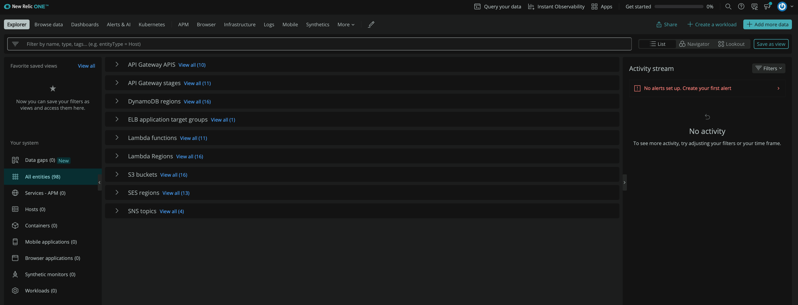
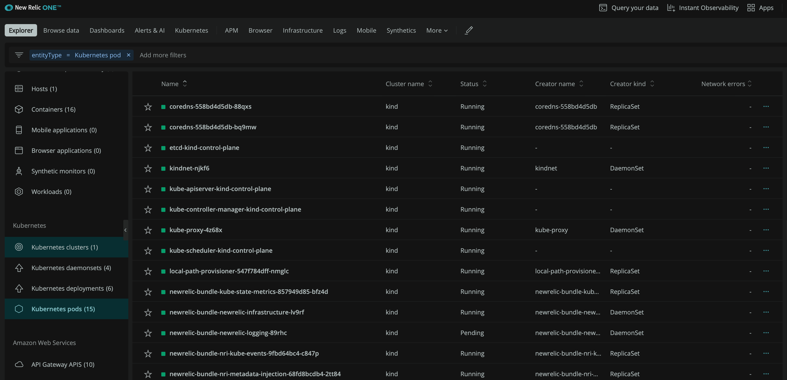

# NewRelic

Terraform sample to create IAM Role for New Relic AWS Integration.

# Quickstart (AWS Integration)

1. [Create New Relic Account](https://newrelic.com/signup)

2. Select Tab > Infrastructure > AWS

3. Select API Polling and then external id would be generated for IAM Role

4. Initialize Terraform

```
terraform init
```

5. Apply terraform to create IAM resources for New Relic Integration

enter the external id which was generated previous step

```
terraform apply
var.externalID
  Enter a value:
```

6. walk through the guide which is shown in New Relic GUI

7. You can see your AWS resources like below after 5 minutes



# Quickstart Kubernetes

1. Run the following command which is generated in Infrastructure > Kubernetes

```
helm repo add newrelic https://helm-charts.newrelic.com && helm repo update && \
kubectl create namespace newrelic ; helm upgrade --install newrelic-bundle newrelic/nri-bundle \
 --set global.licenseKey=XXXXXXXXXXXXXXXXXXXXXXXX \
 --set global.cluster=kind \
 --namespace=newrelic \
 --set newrelic-infrastructure.privileged=true \
 --set global.lowDataMode=true \
 --set ksm.enabled=true \
 --set prometheus.enabled=true \
 --set kubeEvents.enabled=true \
 --set logging.enabled=true
```


